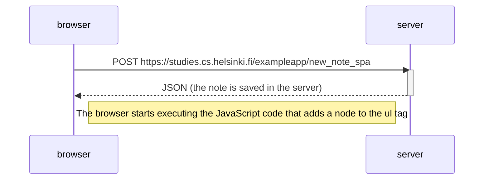

```mermaid
sequenceDiagram
    participant browser
    participant server

    browser->>server: POST https://studies.cs.helsinki.fi/exampleapp/new_note_spa
    activate server
    server-->>browser: JSON (the note is saved in the server)
    deactivate server

    Note right of browser: The browser starts executing the JavaScript code that adds a node to the ul tag
```